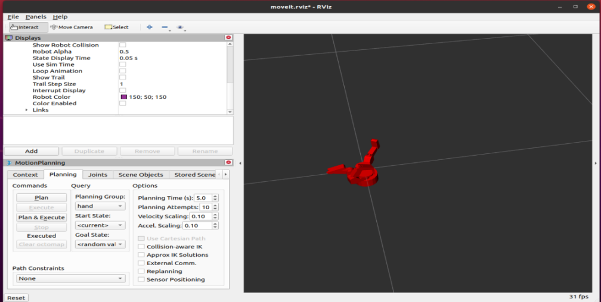

# 配置夹具的 MoveIt

## 前置工作

1. 修改夹具的 URDF
   - 夹具 URDF 位于 `urdf_source` 目录下：

     ```bash

     urdf_source
     └── grippers
         ├── Allegro
         ├── Barrett
         ├── fetch_gripper
         ├── franka_panda
         ├── gripper_pyb_info.pk
         ├── h5_hand
         ├── HumanHand
         ├── jaco_robot
         ├── Manuals
         ├── panda_arm.urdf
         ├── robotiq_2finger
         ├── robotiq_3finger
         ├── sawyer
         ├── shadow_hand
         └── wsg_50
     ```

   - 也可于 [此处](https://github.com/IRVLUTD/isaac_sim_grasping) 下载。

2. 对所有 `./meshes/...` 修改为当前包名，如当前包名为 `barrett_description`，则应修改为 `package://barrett_description/meshes/...`。
  
3. 在工作区下编译：

  ```bash
  catkin_make
  source devel/setup.sh
  ```

4. 在 ROS 工作区下启动：

  ```bash
  roslaunch moveit_setup_assistant setup_assistant.launch
  ```

  

  具体配置见 [MoveIt Setup Assistant](https://moveit.github.io/moveit_tutorials/doc/setup_assistant/setup_assistant_tutorial.html)。

5. 配置生成新的 MoveIt 包后，运行 `demo.launch` 证明配置成功。

    

6. 在 MotionPlanning 中可对关节进行控制，也可以在 `moveit_assistant` 的 `Planning Group` 中选择配置 MoveIt 的不同规划组。

## MoveIt 连接 Isaac Sim

### 整体思路


使用上面新生成的 MoveIt 配置控制仿真环境中的机械臂。

1. 修改 `franka_isaac_execution.launch`：

- 将 `panda_moveit_config` 改成由 `moveit_assistant` 生成的新包名，如 `new_robot` 或 `only_arm`。

  ```
  <include file="$(find panda_moveit_config)/launch/planning_context.launch">
    <arg name="load_robot_description" value="true"/>
  </include>
  <include file="$(find panda_moveit_config)/launch/move_group.launch">
  ```

- 先启动仿真环境，再启动 `isaac_moveit` 文件夹下的 `launch` 文件。

2. 配置 ActionGraph

- 在 Isaac Sim 中配置 `ActionGraph` 来发布 ROS 节点。


3. 设置 `TargetPrim`：

- `ROS1 Publish Transform Tree`: .../base_link
- `ROS1 Publish Joint State`: .../base_link
- `Articulation Controller`: .../base_link
- 配置成功后点击 `play`，在终端中输入 `rosrun rqt_tf_tree rqt_tf_tree` 可以看到如下 tf 图：
    

  ```bash
  输入 rostopic echo /joint_states
  ---
  header: 
    seq: 1997
    stamp: 
      secs: 1722500525
      nsecs: 907341718
    frame_id: ''
  name: 
    - hand_joint
    - left_wheel_joint
    - right_wheel_joint
    - servo_link1_joint
    - servo_link2_joint
    - L_joint1
    - L_joint2
    - L_joint3
    - L_joint4
    - L_joint5
    - L_joint6
    - L_drive_joint
    - L_left_finger_joint
    - L_left_inner_knuckle_joint
    - L_right_outer_knuckle_joint
    - L_right_finger_joint
    - L_right_inner_knuckle_joint
    - R_joint1
    - R_joint2
    - R_joint3
    - R_joint4
    - R_joint5
    - R_joint6
    - R_drive_joint
    - R_left_finger_joint
    - R_left_inner_knuckle_joint
    - R_right_outer_knuckle_joint
    - R_right_finger_joint
    - R_right_inner_knuckle_joint
  position: [0.0 0.0 0.0 0.0 0.0 0.0 0.0 0.0 0.0 0.0 0.0 0.4475296347081661 0.4475296347081661 0.4475296347081661 0.4475296347081661 0.4475296347081661 0.4475296347081661 0.0 0.0 0.0 0.0 0.0 0.0 0.0 0.0 0.0 0.0 0.0 0.0]
  velocity: []
  effort: []
  ```

4. 配置 ActionGraph 代码

- 创建一个包含 ROS 组件节点的 Action Graph：

  ```python
  try:
      og.Controller.edit(
          {"graph_path": "/ActionGraph" "evaluator_name": "execution"}
          {
              og.Controller.Keys.CREATE_NODES: [ # 创建节点
                  ("OnImpulseEvent" "omni.graph.action.OnImpulseEvent")
                  ("ReadSimTime" "omni.isaac.core_nodes.IsaacReadSimulationTime")
                  ("PublishJointState" "omni.isaac.ros_bridge.ROS1PublishJointState")
                  ("SubscribeJointState" "omni.isaac.ros_bridge.ROS1SubscribeJointState")
                  ("ArticulationController" "omni.isaac.core_nodes.IsaacArticulationController")
                  ("PublishTF" "omni.isaac.ros_bridge.ROS1PublishTransformTree")
                  ("PublishClock" "omni.isaac.ros_bridge.ROS1PublishClock")
              ]
              og.Controller.Keys.CONNECT: [ # 节点连接
                  ("OnImpulseEvent.outputs:execOut" "PublishJointState.inputs:execIn")
                  ("OnImpulseEvent.outputs:execOut" "SubscribeJointState.inputs:execIn")
                  ("OnImpulseEvent.outputs:execOut" "PublishTF.inputs:execIn")
                  ("OnImpulseEvent.outputs:execOut" "PublishClock.inputs:execIn")
                  ("OnImpulseEvent.outputs:execOut" "ArticulationController.inputs:execIn")
                  ("ReadSimTime.outputs:simulationTime" "PublishJointState.inputs:timeStamp")
                  ("ReadSimTime.outputs:simulationTime" "PublishClock.inputs:timeStamp")
                  ("ReadSimTime.outputs:simulationTime" "PublishTF.inputs:timeStamp")
                  ("SubscribeJointState.outputs:jointNames" "ArticulationController.inputs:jointNames")
                  ("SubscribeJointState.outputs:positionCommand" "ArticulationController.inputs:positionCommand")
                  ("SubscribeJointState.outputs:velocityCommand" "ArticulationController.inputs:velocityCommand")
                  ("SubscribeJointState.outputs:effortCommand" "ArticulationController.inputs:effortCommand")
              ]
              og.Controller.Keys.SET_VALUES: [ # 设置节点的值
                  # Setting the /Franka target prim to Articulation Controller node
                  ("ArticulationController.inputs:usePath" True)
                  ("ArticulationController.inputs:robotPath" FRANKA_STAGE_PATH)
                  ("PublishJointState.inputs:targetPrim" [usdrt.Sdf.Path(FRANKA_STAGE_PATH)])
                  ("PublishTF.inputs:targetPrims" [usdrt.Sdf.Path(FRANKA_STAGE_PATH)])
              ]
          }
  )
  ```

- 更改 `FRANKA_STAGE_PATH`部分为自己的路径。
- 注意：选择 `targetPrim` 时要绑定到物体的 `base_link` 上，因为 2023.1.1 版本的 Isaac Sim 把 `ArticulationAPI` 绑定到了 `base_link` 上，而不是物体本身。

## Urdf 转 USD

1. 在 Isaac Sim 的左上角打开 `Isaac Unit` → `Workflows` → `URDF Importer`

    
    

2. 如果没有 URDF，只有 xacro 文件，可以使用：

```bash
rosrun xacro xacro yourfile.xacro > filename.urdf
```

## 机械臂和夹具在仿真环境中拼接

### 两种方法

1. Assemble
  [this](https://docs.omniverse.nvidia.com/isaacsim/latest/advanced_tutorials/tutorial_advanced_assembling_robots.html)
2. 手动添加 Joint

- 把夹具移动到机械臂末端合适的位置，然后把机械臂末端的 `link` 和夹具的 `base_link` 之间添加 `joint`。
  - `Body0` 是父 `link`，`body1` 是子 `link`。

# Ir100

- 描述文件：
- 配置好的 MoveIt

- Ir100 的 tf 树：
    
- Ir100 的 USD：`~/shiys/new_robot.usd`
- 目前一直有问题，还在调。。。

### 可能的解决方法

- 不使用仿真环境发布 `/tf`，用 `demo.launch` 发布，接着启动 `isaac_moveit` 目录下的 `ir100.launch`。
- 修改 USD，在 xacro 文件中添加一个真正的 `base_link`（不含有 visual 和 collision 的，用于在仿真环境中添加 Articulation Root）→ Urdf→USD。

## 一些补充

### 手动修改 URDF 拼接 `panda_arm` 和 `allergo_hand`

- 这是 MoveIt。
- 这是机械臂和手拼接后的 xacro 文件，代码里写了注解。
- 启动命令：

```bash
roslaunch panda_allergo_v2 demo.launch
```

# 一些烂七八糟的

### 手改urdf拼接panda_arm和allergo_hand

⬅这是moveit
⬅这是机械臂和手拼接后的xacro文件，代码里写了注解

```bash
roslaunch panda_allergo_v2 demo.launch
```


